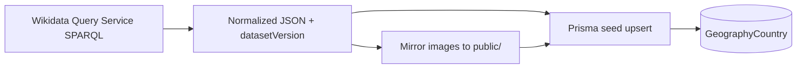

# Task 005 — Geography quiz: implementation plan (by phase)

> **Mục đích:** lộ trình triển khai [spec.md](./spec.md) — **chưa code**; dùng làm checklist khi bắt đầu implement.  
> **Tham chiếu kiến trúc hiện có:** `QuizType` trong `src/modules/quiz/types.ts`, MC flow task 004 (`multiple-choice-session`, `MultipleChoicePlayer`, `parseQuizCreateBody`), `src/app/play/[shareLink]/page.tsx`.  
> **Ngày lập:** 2026-04-18.  
> **Lưu catalog:** **phương án B** — bảng `GeographyCountry` (hoặc tên tương đương) + seed từ pipeline Wikidata offline; chi tiết đầy đủ: [§ Phương án B](#plan-b-geography-country).

---

## 0. Nguyên tắc chung (khi bắt đầu code)

1. Cuối mỗi phase có thay đổi hành vi: chạy **`npm run e2e`** (và `npm run verify` nếu đụng UI admin) — suite xanh trước khi merge phase.
2. File E2E mới đặt theo quy ước repo, ví dụ: `e2e/task-005-geography-admin.spec.ts`, `e2e/task-005-geography-play.spec.ts`; cập nhật `e2e-test-report.md` khi có case (tạo file report khi phase có E2E).
3. **Không lộ đáp án** trong response GET “round hiện tại” — giữ nguyên tắc giống MC (task 001/004).
4. Mọi text người chơi thấy cho type này: **English** (admin UI có thể tiếng Việt nếu phần còn lại app đang VN — ghi rõ trong PR).

---

## Phase 0 — Chốt quyết định & hợp đồng dữ liệu

| | Nội dung |
|---|----------|
| **Input** | [spec.md](./spec.md) §7 (open decisions); danh sách châu lục; nguồn cờ + Wikidata fields. |
| **Output** | Tài liệu ngắn trong folder task (có thể mở rộng `spec.md` hoặc thêm `data-contract.md`): schema JSON trung gian **khớp cột Prisma** (xem [§ Phương án B](#plan-b-geography-country)); quy ước **continent enum**; quyết định **single vs multi** continent v1; bảng `GeographyCountry` + index (`iso3166Alpha2` hoặc `wikidataId` unique). |
| **E2E** | Không đổi code → không bắt buộc; có thể chạy regression nếu song song task khác. |

**Rủi ro:** thiếu landmark cho một số quốc gia → plan fallback (chỉ dùng `flag_to_country` + `country_to_capital` cho nước đó).

---

## Phase 1 — Dataset & asset pipeline (offline)

| | Nội dung |
|---|----------|
| **Input** | Hợp đồng phase 0; license flags/Commons; quy trình [§ Phương án B](#plan-b-geography-country). |
| **Output** | (1) Script **export** Wikidata → JSON tạm (`data/geography/raw/*.json`) *hoặc* query thủ công + lưu file. (2) Script **mirror ảnh** (cờ + landmark) → `public/geography/...` + ghi path tương đối vào JSON chuẩn. (3) Script **`prisma db seed`** (hoặc `tsx scripts/seed-geography-from-json.ts`): đọc JSON đã chuẩn → **`upsert`** vào bảng **`GeographyCountry`**. Commit JSON “đã chuẩn” + version string (`datasetVersion`) **tuỳ chọn** để audit. **Không** cần UI. |
| **E2E** | Regression toàn repo nếu đã có PR chạy CI. |

---

## Phương án B — Wikidata → bảng `GeographyCountry` (chi tiết implement)

> **Từ vựng:** đây **không** phải “crawl HTML” website quiz; đây là **truy vấn có cấu trúc** (SPARQL / API Wikibase) + **xuất snapshot** + **seed DB**. Tuân thủ [Wikidata Query Service](https://wikidata.org/wiki/Wikidata:Query_Service/User_Manual) (User-Agent, giới hạn tần suất).

### B.1. Nguyên tắc vận hành

1. **Runtime app** chỉ đọc **PostgreSQL** (`GeographyCountry`); **không** gọi `query.wikidata.org` mỗi request người chơi.
2. **Refresh dữ liệu** là tác vụ **dev/ops định kỳ** (ví dụ vài tháng/lần): chạy lại pipeline → JSON mới → seed → bump `datasetVersion`.
3. Mọi URL Commons trong giai đoạn export chỉ là **tham chiếu**; file phục vụ UI là **bản đã tải về** (cache local) trừ khi team chốt cố tình dùng remote (không khuyến nghị).

### B.2. Bước 1 — Thu thập quốc gia + thủ đô + châu (SPARQL)

- **Endpoint:** `https://query.wikidata.org/sparql` — HTTP **GET** hoặc **POST** (`application/x-www-form-urlencoded`, tham số `query=`).
- **User-Agent:** bắt buộc khai báo rõ (policy WDQS), ví dụ: `quizzes-geography-importer/1.0 (contact: …)`.
- **Chiến lược query:**  
  - **Hạn chế timeout:** không một query “toàn cầu” quá nặng; có thể **chia theo châu** (`VALUES ?continent { wd:Q15 … }`) hoặc theo nhóm `?country` với `FILTER` `wdt:P31 wd:Q6256` (sovereign state) — **chốt predicate** lúc implement (có thể dùng subclass of country + filter exclude historical).  
  - **Nhãn tiếng Anh:** `SERVICE wikibase:label { bd:serviceParam wikibase:language "en". }` hoặc `?country rdfs:label ?countryLabel . FILTER(LANG(?countryLabel) = "en")`.
- **Thuộc tính gợi ý (cần verify trên WD từng item):**  
  - Instance of country: thường `wdt:P31/wdt:P279* wd:Q6256` hoặc instance `wd:Q3624078` — **phải test** để tránh territory lẫn.  
  - Capital: `wdt:P36`.  
  - Continent: `wdt:P30` (hoặc kết hợp `P463` nếu cần) — map về enum nội bộ (`Africa`, `Asia`, …).  
  - ISO 3166-1 alpha-2: `wdt:P297` → cột **`iso3166Alpha2`** (unique index).  
  - Wikidata id: `?country` IRI → lưu **`wikidataId`** dạng `Q668`.
- **Đầu ra bước 1:** file JSON array mỗi phần tử có ít nhất: `wikidataId`, `iso3166Alpha2`, `nameEn`, `capitalEn`, `continent` (enum app).

### B.3. Bước 2 — Cờ (flag asset)

- **Ưu tiên:** map `iso3166Alpha2` → file trong repo (bộ SVG/PNG mở, ví dụ package có LICENSE MIT/CC0) → cột **`flagLocalPath`** (ví dụ `/geography/flags/in.svg`).  
- **Tuỳ chọn:** lấy filename từ Wikidata (`P41` image) rồi mirror qua URL Commons — khi đó vẫn lưu **`flagLocalPath`** sau mirror, kèm **`flagSourceUrl`** + license nếu bắt buộc attribution.

### B.4. Bước 3 — Landmark (ảnh địa danh)

- **Không** bắt buộc một SPARQL duy nhất; thường là **pipeline 2 pha:**  
  - **Pha A:** đã có danh sách `wikidataId` từ bước 1.  
  - **Pha B:** query (hoặc lô `wbgetentities`) lấy **một** ảnh đại diện: ví dụ `wdt:P18` trên item “địa danh” được chọn làm đại diện quốc gia — **hoặc** chọn item loại heritage/landmark thuộc country (phức tạp hơn, cần rule ranking: ưu tiên UNESCO, số sitelinks, v.v.).  
- Với mỗi ảnh Commons: lưu **`landmarkSourceUrl`**, và nếu API cho phép: **`landmarkAuthor`**, **`landmarkLicense`** (string SPDX hoặc text WD). Script mirror tải file `original` hoặc kích thước cố định → **`landmarkLocalPath`**.

### B.5. Bước 4 — Chuẩn hoá & kiểm tra chất lượng

- Script validate Node/TS:  
  - `iso3166Alpha2` đúng 2 ký tự, unique.  
  - `capitalEn` không rỗng (hoặc loại row nếu thiếu — ghi log).  
  - `continent` ∈ tập enum app.  
  - `flagLocalPath` tồn tại trên disk.  
  - `landmarkLocalPath` optional: nếu thiếu thì generator **không** chọn template `landmark_to_country` cho row đó.  
- Xuất **`geography-countries.normalized.json`** + trường **`datasetVersion`** (semver hoặc ngày `YYYY-MM-DD`).

### B.6. Bước 5 — Seed Prisma (`upsert`)

- Trong migration tạo bảng **`GeographyCountry`** (tên cuối chốt lúc code), ví dụ các cột:

| Cột (gợi ý) | Kiểu | Ghi chú |
|-------------|------|---------|
| `id` | `cuid()` / UUID | PK nội bộ |
| `wikidataId` | `String` | `@unique` |
| `iso3166Alpha2` | `String` | `@unique`, index cho join generator |
| `nameEn` | `String` | |
| `capitalEn` | `String` | |
| `continent` | `String` / enum Prisma | Map từ WD |
| `flagLocalPath` | `String` | URL path public |
| `landmarkLocalPath` | `String?` | |
| `landmarkSourceUrl` | `String?` | Attribution |
| `landmarkLicense` | `String?` | |
| `landmarkCredit` | `String?` | Plain text “Author / © …” |
| `datasetVersion` | `String` | Trùng metadata snapshot |

- Seed: `upsert` theo `wikidataId` hoặc `iso3166Alpha2` để chạy lại idempotent.  
- **`Quiz` (geography):** cột JSON **`geographyContinents`** (mảng string) hoặc bảng join — **không** duplicate toàn bộ country vào quiz.

### B.7. Giới hạn kỹ thuật & lịch sự với WDQS

- Tránh burst: `sleep`/rate limit giữa các request nếu tách nhiều query.  
- Không chạy pipeline nặng trên **mỗi** CI build mặc định — chỉ chạy khi có thay đổi data hoặc job scheduled.  
- Lưu **query SPARQL** (`.rq`) trong repo để tái lập kết quả.

### B.8. Sơ đồ luồng (tóm tắt)

---

## Phase 2 — Prisma & quiz payload admin

| | Nội dung |
|---|----------|
| **Input** | Model `Quiz` hiện tại; pattern migration task 004. |
| **Output** | Thêm `geography` vào `QuizType` / enum DB (nếu có); migration tạo **`GeographyCountry`** (theo [§ Phương án B](#plan-b-geography-country)); field trên **`Quiz`** lưu **phạm vi châu lục** (JSON array string hoặc relation — chốt khi thiết kế). `prisma generate`. Validator `parseQuizCreateBody` nhánh `geography`: bắt buộc continent scope; không tạo quiz nếu pool sau filter rỗng (**`count` trên `GeographyCountry`** theo continent đã chọn). |
| **E2E** | `npm run e2e` regression; chưa bắt buộc file task-005 nếu chưa có UI. |

---

## Phase 3 — Domain: generator một round

| | Nội dung |
|---|----------|
| **Input** | Bảng **`GeographyCountry`** đã seed; rules distractor (ưu tiên cùng châu). |
| **Output** | Module thuần (ví dụ `src/modules/quiz/lib/geography-round.ts`): `buildRound({ pool, continentFilter, templates, rng }) → { promptEn, optionsEn[4], correctIndex, media }` — **correctIndex** chỉ dùng server-side; unit test Vitest cho tính hợp lệ (4 unique countries khi đủ pool, shuffle không đổi “truth” nội bộ). |
| **E2E** | Tuỳ chọn chỉ unit test; chưa cần Playwright. |

---

## Phase 4 — API public: session vô hạn đến khi sai

| | Nội dung |
|---|----------|
| **Input** | Module phase 3; pattern `GET/POST` của `multiple-choice-session`. |
| **Output** | Route mới hoặc mở rộng có kiểm soát: lưu **server-side state** phiên (round index, streak, seed) — có thể DB row `GeographySession` hoặc stateless signed token (chốt theo độ phức tạp mong muốn). GET trả round kế; POST chấm điểm, trả reveal, set `gameOver` nếu sai. **Không** trả đáp án đúng trong GET. |
| **E2E** | `e2e/task-005-geography-play.spec.ts` tối thiểu: GET không chứa field lộ đáp án; một vòng đúng + một vòng sai → `gameOver`. |

---

## Phase 5 — Admin UI

| | Nội dung |
|---|----------|
| **Input** | Validator phase 2; `QuizForm` / flow tạo quiz hiện tại. |
| **Output** | Khi chọn type Geography: UI chọn châu lục (checkbox hoặc select theo spec chốt); nút submit tạo quiz; không form nhập câu. Đăng ký `registry` / `quizTypeSupports*` nếu repo đã dùng. |
| **E2E** | `e2e/task-005-geography-admin.spec.ts`: đăng nhập admin → tạo geography quiz với scope → thấy trong list / có `shareLink`. |

---

## Phase 6 — Player UI (`/play/[shareLink]`)

| | Nội dung |
|---|----------|
| **Input** | API phase 4; UX tham chiếu `MultipleChoicePlayer` (timer, khóa chọn, reveal, game over, play again). |
| **Output** | Component `GeographyPlayer` (hoặc tên tương đương): English copy; hiển thị cờ / landmark qua `next/image` với domain/asset local đã cấu hình; streak counter; lỗi mạng nhẹ nhàng. |
| **E2E** | Mở rộng `task-005-geography-play`: happy path vài round (có thể seed cố định trong test). |

---

## Phase 7 — Docs, rules Cursor, STATUS

| | Nội dung |
|---|----------|
| **Input** | Code phase 1–6 hoàn chỉnh. |
| **Output** | Cập nhật `.cursor/rules/quiz-product-architecture.mdc`, `quiz-data-and-api.mdc` (nếu có endpoint mới); [../STATUS.md](../STATUS.md) → task 005 **Hoàn thành** / **Gần xong**; `tasks/README.md` bảng folder; `e2e-test-report.md` trong task-005. |
| **E2E** | `npm run verify` (hoặc tối thiểu e2e + lint + build theo thói quen repo). |

---

## Bảng theo dõi phase (cập nhật khi làm)

| Phase | Trạng thái | Ghi chú |
|-------|------------|---------|
| 0 — Decisions & data contract | **Chưa làm** | |
| 1 — Dataset & assets | **Chưa làm** | |
| 2 — Schema & create API | **Chưa làm** | |
| 3 — Round generator (lib) | **Chưa làm** | |
| 4 — Public session API | **Chưa làm** | |
| 5 — Admin UI | **Chưa làm** | |
| 6 — Player UI | **Chưa làm** | |
| 7 — Docs & verify | **Chưa làm** | |

---

## Phụ thuộc & rủi ro

| Phụ thuộc | Ghi chú |
|-----------|---------|
| Task 004 MC | Tái sử dụng **pattern** session/reveal; geography **không** dùng `MultipleChoiceQuestion` rows trừ khi muốn unify (hiện tại spec định hướng generated). |
| `next/image` | Remote patterns hoặc chỉ local static files sau mirror. |
| Pool nhỏ | Antarctica / đảo nhỏ: cần ngưỡng tối thiểu số nước để bật quiz hoặc loại template. |

---

*Cập nhật: 2026-04-18 — plan only, no implementation; bổ sung § Phương án B (Wikidata → `GeographyCountry`, chi tiết pipeline).*
